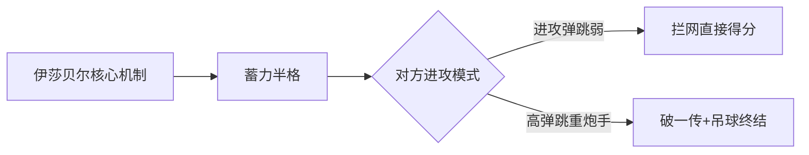

本文章永久分享链接： `https://tflow.top/TheSpike/colosseum`

周一到周五可每天挑战一个boss共2次，周末可每天挑战3个boss共6次。

每次击败boss可获得**25~29个蓝焰**（关卡内与黄色图标精英队对战可加两个蓝焰）

本文对**比赛机制进行介绍**，并针对`重炮手/防守` 流派的HARD难度 提供**实战攻略**

# 比赛机制介绍

竞技场共有6个阶段，每个阶段都需要进行一场比赛或者休息。进行比赛前，需要从给定的能力卡中选择一张使用，**能力卡的效果仅作用于玩家所操作的球员，且会叠加**。最后一个阶段为BOSS战。全部阶段共用10条生命，可通过休息阶段补充。

## 阶段图标说明

 `普通队伍阶段`：队伍实力较弱

 `精英队伍阶段`：与精英队伍对战一次，最终蓝焰奖励+2 。 队伍实力较强，包括瓦伦蒂亚尖峰队（西川），全明星队（李英燮），艺术高中校友队（尚贤），绿色莱昂队，太阳排球队（绿洲） 

 `恢复`：恢复的生命值越多，扣除的属性越多

 Boss队伍：伊莎贝尔、罗伯特、NN

## 能力卡说明

### 第一阶段能力卡

这种能力卡只在第一阶段选择，**类似于难度定级**，根据自己的能力选择对应难度的能力卡

`EASY`：最终胜利奖励15蓝焰，每次比赛开始时恢复1点体力，新手推荐选用这类能力卡

`HARD`：最终胜利奖励25蓝焰，降低的能力值较多，适用于掌握竞技场机制的老玩家

`EXTREME`：最终胜利奖励25蓝焰，降低的能力值非常多，只适合挑战极限了(

如图所示↓

### 恢复能力卡

**恢复阶段**可使用恢复能力卡，分为 +2体力、+4体力、+8体力，恢复体力越多，扣除属性越多

### 增益能力卡（普通）

除第一阶段外的**比赛**前需要选择一张增益能力卡使用，效果可叠加，可大致分为4种流派的增益能力卡，如下图所示

- `重炮手流派`：着重增加攻击力，适用于重炮手，如昊天
- `攻跳流派`：同时增加攻击力和弹跳，适用于需要弹跳的重炮手，如西川、卢卡斯
- `防跳流派`：同时增加防御力和弹跳，适用于吃防守机制的保姆，如伊莎贝尔、山寺、哈里
- `防守流派`：着重增加防御力，适用于吃防守机制的保姆，**尤其推荐伊莎贝尔**。

### 增益能力卡（特殊）

特殊卡牌可以理解为强力buff，除了无明显副作用的能力值增益之外，还会赋予特定球员技能特性到当前操作球员上。特殊卡牌也能像普通卡牌分4个流派。部分能力卡如图所示：

# 防守流派HARD攻略

[点击查看攻略视频-以伊莎贝尔为例](https://www.bilibili.com/video/BV1i7pgzwEMP)，下方提供文字说明和伊莎贝尔的核心机制

> [!NOTE]- 文字说明
> ## 防守流派核心优势
> 
> 防守流派通过**高防御+精准拦网 + 机制克制** 实现“零封式进攻”，特别适配伊萨贝尔、山寺、哈里等防守型保姆球员。其优势在于：
> 
> 1. **容错率高** ：减少对方扣杀得分概率
> 2. **节奏控制** ：通过拦网快速结束回合
> 3. **稳定性强** ：属性需求集中于防御/弹跳
> 
> ## 选卡铁律
> - **必选HARD难度** （奖励25蓝焰）
> - **重新抽取次数≤3次** （代价随次数递增）
> - ✨ _实战技巧_ ：若第一阶段抽卡不顺，可故意输一局重置卡池（除重置券之外）
> - 优选**防守流派专属卡** （防御+20 或 防御/弹跳双加成）
> - **规避双负面效应卡** （如同时减防守+弹跳）

# 重炮手流派HARD攻略

[点击查看攻略视频-以李英燮为例](https://www.bilibili.com/video/BV1MPpjzNEuL/)，下方提供文字说明

> [!NOTE]- 文字说明
> ## 重炮手流派核心优势
> 
> 重炮手通过**极限攻击+弹跳压制** 实现"暴力扣杀"，专为昊天、李英燮、亚提斯等强力主攻设计。其优势在于：
> 
> 1. **破防能力极强** ：无视常规防守体系
> 2. **速战速决** ：单次蓄力即可终结回合
> 3. **收益最大化** ：精英队讨伐效率高
> 
> ## 选卡准则
> - **必选HARD难度** （保证25蓝焰基础收益）
> - **抽卡≤3次** （每次重置消耗递增）
> - **核心规避** ：攻击削弱超过-10的卡牌坚决放弃
> - **重炮手专属卡** （攻击+20 或 攻击/弹跳双加成）

